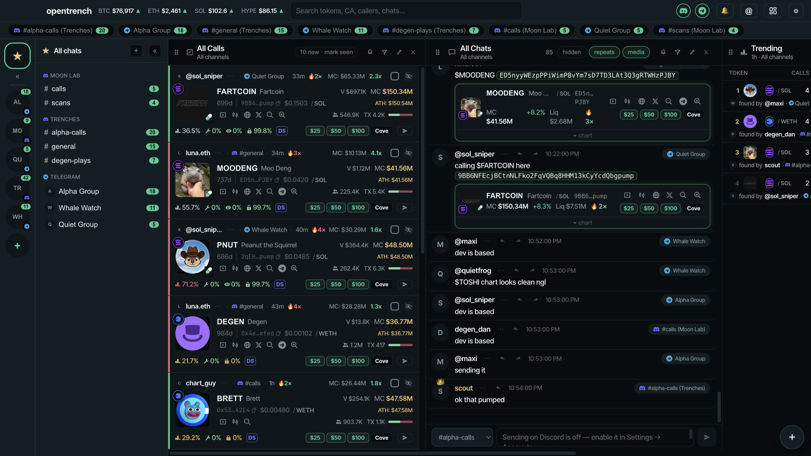
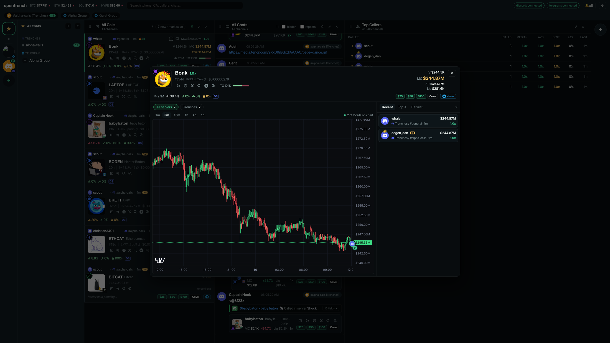

# opentrench

[](https://discord.gg/6ByE8fPNN)
[](https://github.com/frogeth/opentrench/releases/latest)

One live feed for your Discord channels and Telegram chats, with contract
addresses highlighted and copyable. Runs entirely on your machine.

**Community:** questions, feature requests and release news in the
[opentrench Discord](https://discord.gg/6ByE8fPNN). New here? Start with
[Getting started](docs/getting-started.md). What changed: [CHANGELOG](CHANGELOG.md).

## Screenshots

The column terminal: All Calls, All Chats and a Top Callers leaderboard over
fake chats and callers.



Click a token's image for the drill-down: candles on a market-cap axis with
every caller pinned where they called, and the full call list.



> **Discord** connects through a small [Vencord plugin](vencord/) inside your own Discord app, so there is no token and no self-bot session. From 0.8.7 the desktop app installs it for you: ⚙ → Accounts → Discord → **Set up Discord**. Discord has to be open for that side of the feed to work. A user token still works as a read-only fallback. Website and setup guides: **https://opentrench.app**

> **OpenSea mint wallet**: use a dedicated wallet, not one holding real funds. The private key is stored encrypted in `config.json` with a key kept in your OS keychain, but anyone who can run code as your user on this machine can still get at it. Mint transactions are irreversible once sent. MintGo and OpenSea expose no official public API for any of this; opentrench reads their unofficial web endpoints, which can change without notice.

## Install

Download one file from the [latest release](https://github.com/frogeth/opentrench/releases/latest)
and open it. Nothing else needs installing: no Node, no npm, no git.

| Your machine | File |
| --- | --- |
| Mac, Apple Silicon (any Mac from 2020 on) | `opentrench-x.y.z-arm64.dmg` |
| Mac, Intel | `opentrench-x.y.z.dmg` (no `arm64` in the name) |
| Windows | `opentrench-Setup-x.y.z.exe` |

A three-step checklist on first launch covers Discord, Telegram and channels;
the long version is [Getting started](docs/getting-started.md) or
https://opentrench.app/docs/.

### Set up with Claude

The repo ships a [Claude skill](skills/opentrench-setup/SKILL.md) that walks a
new user through install, both accounts, channels and the usual snags. With
Claude Code:

```bash
git clone --depth 1 https://github.com/frogeth/opentrench /tmp/opentrench
mkdir -p ~/.claude/skills
cp -r /tmp/opentrench/skills/opentrench-setup ~/.claude/skills/
```

Then say "set up opentrench". Without git, paste the skill's text into any Claude chat.

## Run from source (developers)

```bash
npm install
npm run build
npm start          # http://127.0.0.1:3210
```

Dev mode with hot reload (`http://localhost:5173`):

```bash
npm run dev
```

## What the feed does

One Discord-style layout for both platforms. The rail on the far left has
**★ All** pinned on top, then your Discord servers and Telegram chats as icons
(each badged with its platform's logo, drag to reorder — the order is saved),
and **+**. The « next to ★ collapses the channel pane. The pane lists only
what's in your feed for the selected rail item: channels by category for a
server, everything (grouped by server / Telegram) for All. Then
**Calls** (one card per contract, newest call first) and **Chats**, both scoped
to whatever is selected; a focused chat groups messages by author like
Discord. The tab row under the header is a quick switcher across every watched
chat.

**+** opens the picker: every server & channel, or every Telegram chat, with a
`+ add` / `✓ in feed` toggle and a preview eye. Clicking a name **previews**
its recent history without adding it (a banner offers "+ add to feed").
Clicking a ticker under a message jumps to and flashes its card in Calls.
The search box matches text, authors, chats, tickers and addresses.

Settings (⚙) is one modal with three tabs: **Accounts** (Discord bridge status,
Telegram login), **Feed** (favorite callers & pings, blacklist), **Trading**
(Cove amounts, o1 key, OpenSea mint wallet and RPCs). Channels are managed in
the sidebar, not in settings.

- Newest on top. Discord and Telegram merged, with each platform's logo and the
  poster's avatar.
- Every contract address becomes a card: ticker, name, chain, price, market
  cap, liquidity, 24h change, a **live chart** you can expand in place, and
  icon links for chart / website / 𝕏 / Telegram / explorer. Click the ticker
  or address to copy.
- Token data is layered, so a minutes-old launch still resolves: Rick-style
  scanner posts (parsed, never shown) → Dexscreener → GeckoTerminal (covers
  Robinhood Chain and fresh pools) → Bankr (launch name, chain, socials). A
  token with no price yet is re-checked after 1 and 5 minutes.
- "called N×" counts distinct callers: one call per person per chat (hover to
  see who). The same person re-posting a contract in the same chat is a repeat;
  a different person in that chat is a new call.
- **Call cards** show the caller (with a 👑 if favorited), age, live market
  cap, token image with chain badge, ticker, token age, price, a buys/sells
  bar, volume, market cap, ATH since first call, liquidity, Cove buttons and
  a Telegram **share** button. Market numbers refresh every minute for tokens
  called in the last 24h. A token called by a second chat glows and jumps to
  the top; three or more chats turns it red.
- **Favorite callers** (⋯ next to a name → 👑) ping you when they post a
  contract nobody has called yet: a desktop notification with a sound (enable
  with the 🔔 in the top bar) and a message to your own Telegram Saved
  Messages (toggle in Settings).
- **Live prices from the pool.** Uniswap v2 / v3 / v4 pools and pump.fun curves
  are read on-chain (one batched RPC per chain, every 5 s for the last hour's
  calls); cards show a green dot when the number is live. Public RPCs work out
  of the box; Settings → Feed → Market data takes an Alchemy key or a custom
  RPC per chain. Dexscreener / GeckoTerminal fill in the rest and price what the
  pools cannot.
- **Launchpads.** pump.fun (coin API: image + market cap while still
  bonding), Bankr, Stonks, Pons and Flap (read straight off the token contract
  on Robinhood Chain / BNB), Virtuals, Clanker and letsbonk are detected
  automatically; o1 needs an API key (Settings → Trading). The launchpad's logo sits on the
  token image and links to the launch page, and the launchpad's own token
  image and socials fill in when no chart site has them yet. IPFS images go
  through a local gateway-hopping proxy.
- **Buy buttons** open Cove (t.me/cove_trading_bot) with the token and a USD
  amount prefilled, same deep-link format frogr uses. Amounts live in
  Settings → Buy buttons. Every Cove and BasedBot link carries opentrench's own
  referral code, fixed in the code and not a setting: the bots' referral
  payouts help cover development costs, and they change nothing about your
  price or fees. Supported chains: Ethereum, Base, BNB, Robinhood Chain,
  MegaETH, Solana.
- Charts come from **BasedBot** (token-address embeds on Robinhood, Base,
  Ethereum, Solana, BNB, Arbitrum); Dexscreener / GeckoTerminal is the
  fallback and can be made the default in Settings → Feed.
- Three NFT column types, alongside Calls and Chats: **MintGo** (live mints
  on Ethereum, Robinhood Chain and Ink, straight from mintgo.fun — click one
  for its X, OpenSea and website links, the transaction, the deployer's
  history, and a Mint button), **NFT Volume** (Trending or Top
  collections with floor, volume, sales and floor change, and a 1H / 1D
  switch; a collection with an open SeaDrop stage gets a Mint pill), and
  **NFT Mint** (paste a collection or press Mint to quote and mint a
  SeaDrop drop — the card shows the open stage, allowance, price, gas and
  balance; Mint confirms once more, then sends with the wallet from
  Settings → Trading, one mint in flight per wallet).
- A **Plugin** column type: the body is a column drawn by a plugin you
  installed, inside its own sandbox ([docs/plugins.md](docs/plugins.md)).
- **Plugins.** Drop a single JavaScript file into your `plugins` folder (or
  ⚙ → Plugins → add a file / paste a link), read the warning, approve it, and
  it can post a website's feed into opentrench as a chat, fetch that site
  through your own login without ever seeing the cookies, and draw a column of
  its own. Each plugin runs in a sandboxed frame with no network of its own and
  reaches the app only through a versioned `ot` API that stays compatible across
  updates; approval is bound to the file's hash, so a changed file is off until
  you approve it again. Write one: [docs/plugins.md](docs/plugins.md), with a
  commented example in [plugins-examples/](plugins-examples/hello-feed.js).
- Live charts open automatically under every contract in Chats (only the
  ones on screen actually load; switch it off in Settings → Feed).
- Replies show the quoted message above the text; reactions show as pills
  under it and update live (Discord custom emoji render as images).
- Images, GIFs, videos and stickers render inline (Telegram media is fetched
  through your session and served locally). X/Twitter links get a preview
  card from the platform's own unfurl, or from the public fxtwitter API.
- Bot posts and repeat posts (a contract already posted in that same chat) are
  hidden by default. Toggles in the Chats column bring them back. Bots never
  create or count a call.
- **Blacklist** a caller with the 🚫 next to their name (or in Settings):
  they're treated like a bot from then on and the call list is rebuilt.
- Messages, calls, counts and reactions **persist across restarts** in
  `backend/state.json` (written a couple of seconds after each change). Filter matches text, author, chat, ticker and name.

## Desktop app (macOS)

```bash
npm run desktop        # build, then open opentrench as an Electron window
npm run desktop:dist   # build a .dmg into electron/dist/
npm run dist:win -w electron   # Windows installer (.exe), built from macOS
```

### Updates

The app checks GitHub Releases (frogeth/opentrench) on launch and hourly, and
there's "Check for Updates…" in the app menu. Windows installs updates
silently on quit; macOS swaps the app in place because releases are signed
and notarized. One-time setup on the Mac that cuts releases: create a
"Developer ID Application" certificate in Xcode > Settings > Accounts >
Manage Certificates, then store an app-specific password (from
account.apple.com) in the keychain:

```bash
electron/scripts/apple-login.sh you@example.com
```

Cut a release with:

```bash
npm run release -w electron            # patch bump, build mac + win, upload
npm run release -w electron -- minor   # or: major, or an explicit version
```

Windows builds are unsigned too: SmartScreen shows "Windows protected your
PC" on first run → More info → Run anyway. Each user connects their own
Discord and Telegram accounts on first launch.

The desktop app runs the same backend with Electron's bundled Node and keeps
`config.json` / `state.json` in `~/Library/Application Support/opentrench` (an existing trenchfeed folder is adopted once).
Tokens, sessions and the mint wallet key inside `config.json` are encrypted
with a random key the app keeps in the OS keychain (`secret.key`, sealed by
Electron's safeStorage: Keychain on macOS, DPAPI on Windows). A plain-text
file from an older version is sealed on first launch. Only a backend holding
that key can read them; a backend started from the repo (which keeps a key of
its own, see Setup) sees them as unset and leaves them untouched.
First run from the repo copies the dev checkout's files there. If a server is
already listening on 3210 the app attaches to it instead of starting another.
External links open in your default browser. The build is unsigned: on first
launch right-click the app → Open.

## Setup (in the browser, ⚙ top right)

1. **Discord** — paste your user token, save. Then tick the channels to watch.
2. **Telegram** — enter API ID + hash from https://my.telegram.org, save.
   Enter phone → code → 2FA password if prompted. Then tick chats to watch.

Everything is stored in `backend/config.json` (git-ignored, mode 600). Tokens,
sessions and the mint wallet key are encrypted there with a random key the
backend keeps in your OS keychain (the login keychain on macOS, the Secret
Service via `secret-tool` on Linux, DPAPI on Windows with the sealed blob in
`config.json.key`). Where none of those exist the file stays plain text and the
backend says so at start.
Nothing is sent anywhere except to Discord and Telegram.

## Tests

```bash
npm test
```
